---
title: Voice Enabled RAG For Indic Languages
emoji: 🎙️
colorFrom: blue
colorTo: purple
sdk: docker
app_port: 7860
pinned: false
---

# Voice-Enabled RAG System for Indic Languages

A production-quality Retrieval-Augmented Generation pipeline that handles voice and text input in Indian languages, retrieves relevant passages from the `ai4bharat/MSMARCO-XI` dataset using hybrid dense+sparse retrieval, and generates grounded answers with source citations using Groq-hosted LLaMA 3.1 8B Instant.

## Pipeline Architecture

```mermaid
graph LR
    A["🎤 Voice Audio"] --> B["STT<br/>(Sarvam saarika:v2.5)"]
    B --> C["Input Guardrail"]
    T["📝 Text Query"] --> C
    C --> D["Hybrid Retrieval<br/>(Qdrant + BM25 + RRF)"]
    D --> E["Confidence Guardrail"]
    E --> F["Generation<br/>(Groq LLaMA 3.1 8B)"]
    F --> G["Grounding Guardrail"]
    G --> H["✅ Response"]

    style A fill:#e1f5fe
    style T fill:#e1f5fe
    style H fill:#c8e6c9
    style C fill:#fff3e0
    style E fill:#fff3e0
    style G fill:#fff3e0
```



### Data Flow

```
Voice audio ──► Sarvam STT ──► text query ──┐
                                             │
Text query ──────────────────────────────────┤
                                             â–¼
                                    Input Guardrail
                                    (reject garbled/unsafe)
                                             │
                                             â–¼
                                ┌────────────┴────────────┐
                                │    Hybrid Retrieval      │
                                │  ┌──────┐  ┌──────┐    │
                                │  │Qdrant│  │ BM25 │    │
                                │  │Dense │  │Sparse│    │
                                │  └──┬───┘  └──┬───┘    │
                                │     └────┬────┘         │
                                │    RRF Fusion            │
                                └────────────┬────────────┘
                                             │
                                             â–¼
                                    Confidence Guardrail
                                    (reject weak matches)
                                             │
                                             â–¼
                              Groq LLaMA 3.1 8B Generation
                              (context-only, cite sources)
                                             │
                                             â–¼
                                    Grounding Guardrail
                                (reject hallucinated answers)
                                             │
                                             â–¼
                                       ✅ Final Answer
```

## Technical Choices & Rationale

### STT: Sarvam AI (`saarika:v2`)
- **Why**: Best-in-class Indic language ASR. Supports 14+ Indian languages natively (Hindi, Tamil, Bengali, Telugu, Gujarati, Marathi, etc.)
- **Trade-off**: External API call adds 500-2000ms latency, but provides state-of-the-art Indic ASR accuracy.
- **Resilience**: 2 retries with exponential backoff (0.5s, 1s).

### Embedding: `intfloat/multilingual-e5-small`
- **Why**: 118M parameters, strong multilingual benchmarks across Indic scripts. Small footprint and fast CPU inference (~20ms/query).
- **E5 prefix protocol**: Queries prefixed with `query: `, passages with `passage: ` — asymmetric encoding improves retrieval quality.
- **Normalization**: L2-normalized embeddings so inner product = cosine similarity.

### Vector DB: Qdrant (Local Disk Persistence)
- **Why**: High-performance vector database with local embedded storage (`data/qdrant_db`), native cosine distance filtering, payload storage, and zero external infrastructure requirements.
- **Index Scale**: 3,533 chunks (1,891 Hindi, 1,642 English) across 610 real MSMARCO-XI passages.
- **Warmup**: Bilingual startup warmup eliminates cold-start and JIT latency.

### Sparse Retrieval: BM25 (`rank_bm25`)
- **Why**: Complements dense retrieval by catching exact keyword matches that embeddings miss — especially important for Indic languages with rare terms, proper nouns, and numbers.
- **Pre-built**: BM25 index serialized with pickle, zero initialization latency.

### Fusion: Reciprocal Rank Fusion (RRF)
- **Why**: Rank-based fusion that doesn't require score calibration between dense cosine similarities and unbounded BM25 scores.
- **Formula**: `score(d) = Σ 1/(60 + rank_i(d))` — k=60 standard constant.
- **Advantage**: No extra model call, zero calibration latency.

### Chunking: Three Complementary Strategies
1. **Fixed-size** (~200 words, 20% overlap): Simple baseline, no assumptions about text structure.
2. **Sentence-window**: Individual sentences for precise retrieval, ±2 neighbors as context for generation.
3. **Hierarchical parent/child**: ~120-word children for retrieval, ~500-word parents for generation context.
- All strategies run and their chunks are scored together — RRF naturally picks the best match.

### Guardrails: Three Independent Gates, All Local
1. **Input validation**: Reject empty, garbled (STT noise), or prompt-injection attempts.
2. **Confidence gate**: Refuse when top RRF score < threshold (primary "knows when not to answer" mechanism).
3. **Grounding check**: Verify answer content words are grounded in retrieved context via recall-based lexical overlap across Indic and Latin scripts, catching hallucinations.
- **Why local**: No extra LLM calls, sub-millisecond evaluation (<0.5ms), no added latency.

### Generation: Groq (`llama-3.1-8b-instant`)
- **Why Groq**: Low-latency LPU hardware providing 200–500ms inference.
- **Model Choice**: `llama-3.1-8b-instant` provides high instruction compliance with citations, generous rate limits (500k TPD, 30k TPM), and sub-500ms generation.
- **System Prompt**: Strictly constrains answers to context only, explicit refusal when unsure, and mandatory source citations (`[1]`, `[2]`).

## Project Structure

```
src/
  stt.py           # Sarvam STT wrapper with retry logic
  chunkers.py      # Three chunking strategies + Chunk dataclass
  embed.py         # multilingual-e5-small embedding
  retrieve.py      # Hybrid Qdrant+BM25 retrieval with RRF
  guardrails.py    # Three independent safety gates
  generate.py      # Groq LLaMA generation with context-only prompting
  pipeline.py      # Pipeline orchestrator with typed request/response
  latency.py       # Timing utilities and percentile computation
  build_index.py   # Offline index builder for MSMARCO-XI dataset
eval/
  run_latency_test.py  # Batch latency evaluation harness
  test_queries.txt     # 40 balanced test queries
app.py             # FastAPI application
requirements.txt   # Python dependencies
.env.example       # API key template
README.md          # This file
```

## Setup & Reproduction

### 1. Install dependencies

```bash
python -m venv .venv

# Windows
.venv\Scripts\activate
# Linux/Mac
source .venv/bin/activate

pip install -r requirements.txt
```

### 2. Configure API keys

```bash
cp .env.example .env
# Edit .env with your actual keys:
#   SARVAM_API_KEY=...
#   GROQ_API_KEY=...
```

### 3. Build the index (offline, one-time)

```bash
# Build from MSMARCO-XI real passages (600 passages -> ~3,500 chunks)
python -m src.build_index --max-passages 600
```

### 4. Run the API server

```bash
python app.py
# Or with uvicorn directly:
uvicorn app:app --host 0.0.0.0 --port 8000
```

### 5. Query the API

**Text query:**
```bash
curl -X POST http://localhost:8000/query/text \
  -H "Content-Type: application/json" \
  -d '{"query": "मैनहट्टन परियोजना की सफलता का तुरंत क्या प्रभाव पड़ा?"}'
```

**Voice query:**
```bash
curl -X POST http://localhost:8000/query/voice \
  -F "audio=@recording.wav" \
  -F "language=hi-IN"
```

**Health check:**
```bash
curl http://localhost:8000/health
```

### 6. Run latency evaluation

```bash
python -m eval.run_latency_test \
  --queries eval/test_queries.txt \
  --output eval/latency_report.json
```

## Latency Breakdown — Honest Assessment

### What's under 200ms ✅

The **local computation stages** (chunking + hybrid retrieval + guardrail evaluation) are consistently under 100ms:

| Stage | Expected Latency | Measured P50 |
|---|---|---|
| Input guardrail | < 0.1ms | 0.05ms |
| Qdrant dense search | 5-15ms | ~10ms |
| BM25 sparse search | 1-10ms | ~6ms |
| Query embedding (e5) | 15-25ms | ~22ms |
| Confidence guardrail | < 0.1ms | 0.01ms |
| Grounding guardrail | < 0.5ms | 0.23ms |
| **Total local computation** | **< 100ms** | **~40-65ms** |

### External API Stages

External API calls involve network round-trips:

| Stage | Expected Latency | Why |
|---|---|---|
| STT (Sarvam API) | 500-2000ms | Network round-trip + audio transcription |
| Generation (Groq API) | 200-500ms | LPU inference + network round-trip |
| **Total end-to-end (voice)** | **700-2500ms** | Dominated by external network APIs |
| **Total end-to-end (text)** | **250-600ms** | Dominated by LLM generation |

## API Response Structure

```json
{
  "status": "success",
  "answer": "मैनहट्टन परियोजना की सफलता का तुरंत प्रभाव सैकड़ों हजारों निर्दोष जीवन का विनाश था [1,2].",
  "query_text": "मैनहट्टन परियोजना की सफलता का तुरंत क्या प्रभाव पड़ा?",
  "retrieved_chunks": [
    {
      "chunk_id": "hi_1185869_0_fixed_0",
      "text": "मैनहट्टन परियोजना की सफलता का तत्काल प्रभाव...",
      "context_text": "...",
      "doc_id": "hi_1185869_0",
      "strategy": "fixed",
      "score": 0.032787,
      "dense_rank": 0,
      "sparse_rank": 0
    }
  ],
  "stage_timings": {
    "input_guardrail": 0.05,
    "retrieval": 42.60,
    "confidence_guardrail": 0.01,
    "generation": 348.50,
    "grounding_guardrail": 0.20
  },
  "error_message": ""
}
```

### Status Codes

| Status | Meaning |
|---|---|
| `success` | Answer generated, grounded in context, with citations |
| `refused-by-model` | Model determined the retrieved context lacks answer |
| `refused-bad-input` | Input was empty, garbled, or unsafe |
| `refused-no-match` | Retrieval confidence below threshold |
| `refused-ungrounded` | Generated answer failed grounding check |
| `stt-error` | Speech-to-text transcription failed |
| `internal-error` | Unexpected error in pipeline |
