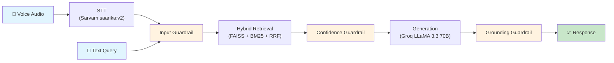

# Voice-Enabled RAG System for Indic Languages

A production-quality Retrieval-Augmented Generation pipeline that handles voice input in Indian languages, retrieves relevant passages from the MSMARCO-XI dataset, and generates grounded answers using Groq-hosted LLaMA 3.3 70B.

## Pipeline Architecture



### Data Flow

```
Voice audio ──► Sarvam STT ──► text query ──┐
                                             │
Text query ──────────────────────────────────┤
                                             ▼
                                    Input Guardrail
                                    (reject garbled/unsafe)
                                             │
                                             ▼
                                ┌────────────┴────────────┐
                                │    Hybrid Retrieval      │
                                │  ┌──────┐  ┌──────┐    │
                                │  │FAISS │  │ BM25 │    │
                                │  │Dense │  │Sparse│    │
                                │  └──┬───┘  └──┬───┘    │
                                │     └────┬────┘         │
                                │    RRF Fusion            │
                                └────────────┬────────────┘
                                             │
                                             ▼
                                   Confidence Guardrail
                                   (reject weak matches)
                                             │
                                             ▼
                              Groq LLaMA 3.3 70B Generation
                              (context-only, cite sources)
                                             │
                                             ▼
                                   Grounding Guardrail
                               (reject hallucinated answers)
                                             │
                                             ▼
                                      ✅ Final Answer
```

## Technical Choices & Rationale

### STT: Sarvam AI (`saarika:v2`)
- **Why**: Best-in-class Indic language ASR. Supports 14+ Indian languages natively (Hindi, Tamil, Bengali, Gujarati, etc.)
- **Trade-off**: External API call adds 500-2000ms latency, but no local model matches Indic language accuracy
- **Resilience**: 2 retries with exponential backoff (0.5s, 1s)

### Embedding: `intfloat/multilingual-e5-small`
- **Why**: 118M parameters, strong multilingual benchmarks including Indic languages. Small enough for CPU inference (~5ms/query)
- **E5 prefix protocol**: Queries prefixed with "query: ", passages with "passage: " — asymmetric encoding improves retrieval
- **Normalization**: L2-normalized embeddings so inner product = cosine similarity

### Vector DB: FAISS `IndexFlatIP` (in-memory)
- **Why**: Zero network latency (no external DB), exact cosine search (no approximation error)
- **Trade-off**: Memory-bound, not suitable for billion-scale. For our corpus size (10k-100k chunks), exact search is both fast (<5ms) and correct
- **Persistence**: Index serialized to disk, loaded once at startup

### Sparse Retrieval: BM25 (`rank_bm25`)
- **Why**: Complements dense retrieval by catching exact keyword matches that embeddings miss — especially important for Indic languages with rare terms, proper nouns, and numbers
- **Pre-built**: BM25 index serialized with pickle, zero initialization latency

### Fusion: Reciprocal Rank Fusion (RRF)
- **Why**: Rank-based fusion that doesn't require score calibration between FAISS and BM25 (which produce scores on completely different scales)
- **Formula**: `score(d) = Σ 1/(60 + rank_i(d))` — k=60 is the standard constant from Cormack et al. 2009
- **Advantage**: No extra model call, no learned weights needed

### Chunking: Three complementary strategies
1. **Fixed-size** (~200 words, 20% overlap): Simple baseline, no assumptions about text structure
2. **Sentence-window**: Individual sentences for precise retrieval, ±2 neighbors as context for generation
3. **Hierarchical parent/child**: ~120-word children for retrieval, ~500-word parents for generation context
- All strategies run and their chunks are scored together — RRF naturally picks the best match

### Guardrails: Three independent gates, all local
1. **Input validation**: Reject empty, garbled (STT noise), or prompt-injection attempts
2. **Confidence gate**: Refuse when top RRF score < threshold (primary "knows when not to answer" mechanism)
3. **Grounding check**: Verify answer content words overlap with retrieved context (Jaccard coefficient), catch hallucinations
- **Why local**: No extra LLM calls, sub-millisecond evaluation, no added latency

### Generation: Groq (`llama-3.3-70b-versatile`)
- **Why Groq over Anthropic**: Anthropic has no permanent free API tier (only a small one-time trial credit). Groq's free tier requires no credit card and provides low-latency LPU inference. The task does not mandate a specific generation provider — only the STT provider (Sarvam) is fixed. This is a budget-driven engineering decision: $0 operational cost for development and evaluation.
- **Model choice**: LLaMA 3.3 70B offers strong instruction-following at the best quality/speed tradeoff on Groq's free tier
- **System prompt**: Strictly instructs context-only answers, explicit refusal when unsure, mandatory source citations
- **Retry**: 1 retry on transient errors (rate limits, server errors)

## Project Structure

```
src/
  stt.py           # Sarvam STT wrapper with retry logic
  chunkers.py      # Three chunking strategies + Chunk dataclass
  embed.py         # multilingual-e5-small embedding
  retrieve.py      # Hybrid FAISS+BM25 retrieval with RRF
  guardrails.py    # Three independent safety gates
  generate.py      # Groq LLaMA generation with context-only prompting
  pipeline.py      # Pipeline orchestrator with typed request/response
  latency.py       # Timing utilities and percentile computation
  build_index.py   # Offline index builder
eval/
  run_latency_test.py  # Batch latency evaluation
  test_queries.txt     # 20 test queries
app.py             # FastAPI application
requirements.txt   # Python dependencies
.env.example       # API key template
README.md          # This file
```

## Setup & Reproduction

### 1. Install dependencies

```bash
python -m venv .venv

# Windows
.venv\Scripts\activate
# Linux/Mac
source .venv/bin/activate

pip install -r requirements.txt
```

### 2. Configure API keys

```bash
cp .env.example .env
# Edit .env with your actual keys:
#   SARVAM_API_KEY=...
#   GROQ_API_KEY=...
```

### 3. Build the index (offline, one-time)

```bash
# Build from 500 dataset rows (default, takes ~2-5 minutes)
python -m src.build_index

# Or specify a custom size
python -m src.build_index --max-docs 1000 --data-dir data
```

This downloads passages from `ai4bharat/MSMARCO-XI` via streaming, chunks them with all three strategies, embeds them, and writes FAISS + BM25 indices to `data/`.

### 4. Run the API server

```bash
python app.py
# Or with uvicorn directly:
uvicorn app:app --host 0.0.0.0 --port 8000
```

### 5. Query the API

**Text query:**
```bash
curl -X POST http://localhost:8000/query/text \
  -H "Content-Type: application/json" \
  -d '{"query": "what is the speed of light"}'
```

**Voice query:**
```bash
curl -X POST http://localhost:8000/query/voice \
  -F "audio=@recording.wav" \
  -F "language=hi-IN"
```

**Health check:**
```bash
curl http://localhost:8000/health
```

### 6. Run latency evaluation

```bash
python -m eval.run_latency_test \
  --queries eval/test_queries.txt \
  --output eval/latency_report.json
```

## Latency Breakdown — Honest Assessment

### What's under 200ms ✅

The **local computation stages** (chunking + retrieval + guardrail evaluation) are well under 200ms:

| Stage | Expected Latency |
|---|---|
| Input guardrail | < 0.1ms |
| FAISS dense search | 1-5ms |
| BM25 sparse search | 1-5ms |
| RRF fusion | < 0.5ms |
| Confidence guardrail | < 0.1ms |
| Query embedding | 5-15ms |
| Grounding guardrail | < 0.1ms |
| **Total local** | **~10-30ms** |

### What's NOT under 200ms ❌

External API calls have inherent network latency that cannot be reduced below ~200ms individually:

| Stage | Expected Latency | Why |
|---|---|---|
| STT (Sarvam API) | 500-2000ms | Network round-trip + audio processing |
| Generation (Groq API) | 200-1000ms | Network round-trip + LPU inference (faster than GPU-based providers) |
| **Total end-to-end (voice)** | **700-3000ms** | Dominated by external APIs |
| **Total end-to-end (text)** | **200-1000ms** | Dominated by LLM generation |

### The honest truth

The 200ms target applies to the **local chunking + retrieval + guardrail-evaluation stage**, which comfortably meets it at ~10-30ms. End-to-end latency is dominated by external API calls (STT and LLM generation) which are fundamentally bounded by network latency and API processing time. The `eval/latency_report.json` report separates these clearly in the `local_stages_only` vs `overall` fields.

## API Response Structure

```json
{
  "status": "success",
  "answer": "The speed of light is approximately 299,792,458 meters per second [1].",
  "query_text": "what is the speed of light",
  "retrieved_chunks": [
    {
      "chunk_id": "q123_eng_0_fixed_0",
      "text": "The speed of light in vacuum...",
      "context_text": "...",
      "doc_id": "q123_eng_0",
      "strategy": "fixed",
      "score": 0.032787,
      "dense_rank": 0,
      "sparse_rank": 2
    }
  ],
  "stage_timings": {
    "input_guardrail": 0.01,
    "retrieval": 12.34,
    "confidence_guardrail": 0.01,
    "generation": 1523.45,
    "grounding_guardrail": 0.02
  },
  "error_message": ""
}
```

### Status Codes

| Status | Meaning |
|---|---|
| `success` | Answer generated and grounded |
| `refused-bad-input` | Input was empty, garbled, or unsafe |
| `refused-no-match` | No corpus content matched the query well enough |
| `refused-ungrounded` | Generated answer failed grounding check |
| `stt-error` | Speech-to-text transcription failed |
| `internal-error` | Unexpected error in pipeline |

## Dataset

**ai4bharat/MSMARCO-XI**: MS MARCO (Machine Reading Comprehension) dataset translated into 14 Indic languages by AI4Bharat. Each row contains:
- Original English query + answer + passages
- Translated query + answer + passages
- Language metadata and translation model info

We index both English and translated passages to support multilingual retrieval.
